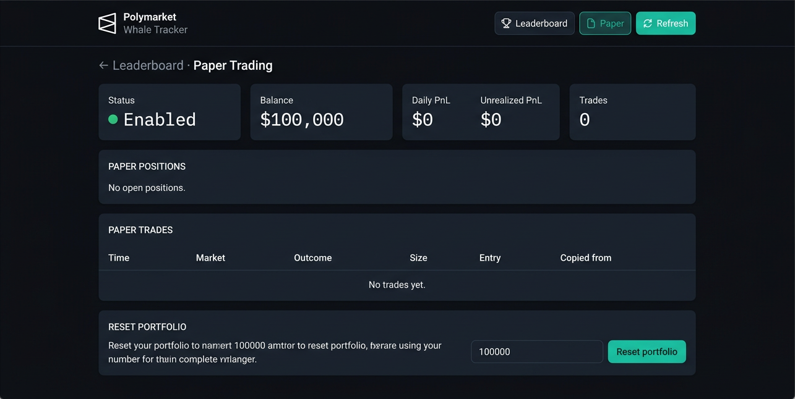
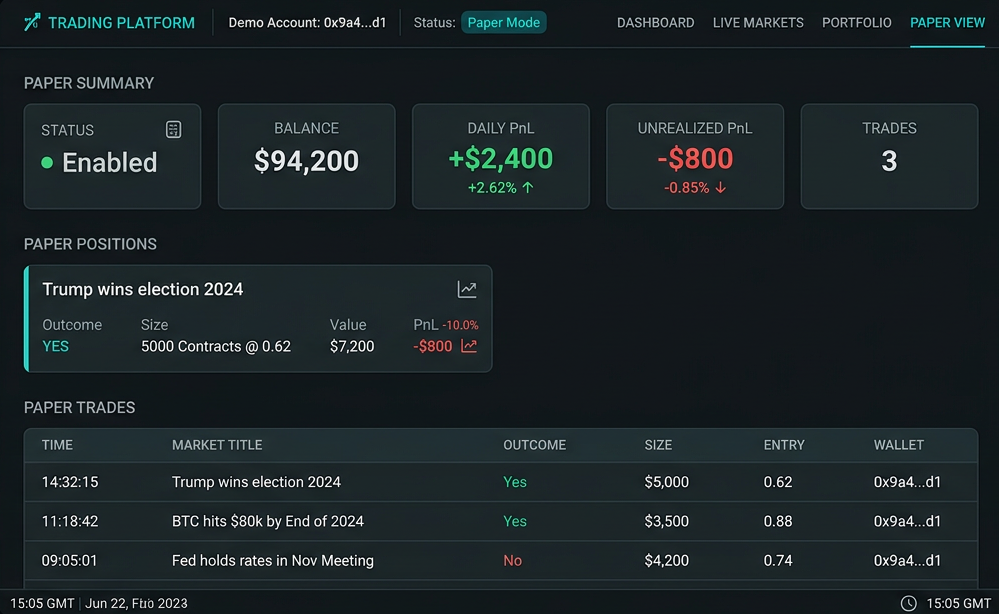
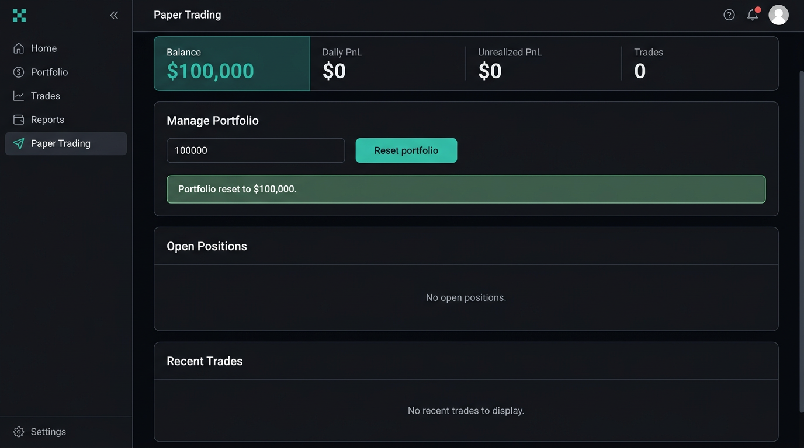

# Polymarket Whale Tracker

Find out who’s actually making money on Polymarket, see what they’re doing, and get notified when the big players open new positions.

Ever wanted to follow the real PnL leaders (not just volume) and get a heads-up on their next move? This does exactly that. It grabs today’s top traders from Polymarket’s leaderboard, tracks their books, and sends you Telegram alerts when they open positions that meet your size and ROI bar. No auth—just public APIs.

---

## What you get

- **Real leaderboard alpha** — Discovery is tied to Polymarket’s leaderboard (today’s top by PnL), so you’re following people who are actually printing, not just big holders in random markets.
- **Copy-trade style signals** — See exactly what those wallets are holding: positions, size, entry, and current P&L. Use it as a flow feed or to mirror ideas.
- **Whale alerts** — When a tracked wallet opens a new position that clears your min size and min ROI, you get an alert (Telegram by default, or Discord if you add it). So you can react to big flow instead of finding it after the fact.

### Paper trading & AI risk agent

Turn on `PAPER_TRADING_ENABLED=true` and every whale alert goes through risk checks before opening a virtual position: **rule-based** stuff (max position % of balance, daily loss limit, max open positions, min whale ROI), and optionally an **AI risk agent** (OpenAI). The agent gets wallet, market, size, your paper balance, and exposure, then returns approve / reject / reduce with a reason. Approved trades show up in a paper portfolio—hit `GET /api/paper/portfolio` to view it, and add `?markToMarket=true` if you want unrealized P&L.

### Leaderboard & book view

- Rank all tracked wallets by total PnL and ROI.
- Click any address to open a full book view: every position, size, and P&L in one place (Polymarket-style cards with icons and links to the market).

### Alert example

```
🐋 Whale Alert

Wallet: 0x9a4...d1
ROI: +480%

Bought: Trump wins election YES
Size: $38k
P&L: $12,400
```

You can keep these in a private Telegram/Discord channel and run it as a paid signal feed if you like.

---

## Quick start

```bash
npm install
cp .env.example .env
# Add your TELEGRAM_BOT_TOKEN and TELEGRAM_CHANNEL_ID
```

**Run the stack**

```bash
# Full stack: tracker + API + dashboard
npm run dev

# API + dashboard only (e.g. port 3001)
npm run api

# One-off: pull today’s top traders from the Polymarket leaderboard into your list
npm run cli -- discover

# One-off: run one tracking pass (check for new whale positions)
npm run cli -- track

# One-off: print leaderboard to the console
npm run cli -- leaderboard
```

If you start with no wallets, it’ll run discover for you so you’re not staring at an empty list.

---

## Config (the knobs that matter)

| Variable | What it does |
|----------|----------------|
| `TELEGRAM_BOT_TOKEN` | From [@BotFather](https://t.me/botfather). |
| `TELEGRAM_CHANNEL_ID` | Your channel (e.g. `@mychannel` or numeric ID). Bot has to be in the channel. |
| `MIN_ALERT_SIZE` | Min position size in $ to trigger an alert (default 5000). Cuts down the noise. |
| `MIN_ALERT_ROI` | Min ROI % on that position to count as a whale alert (default 100). |
| `POLL_INTERVAL_SECONDS` | How often the tracker runs (default 10). Bump it up if you’re worried about rate limits. |
| `PORT` | API/dashboard port (default 3001). |
| `RUN_API` | Set to `false` if you only want the tracker loop and no API/dashboard. |
| `LEADERBOARD_DISCOVER_LIMIT` | How many top leaderboard traders to add when you run discover (default 50). |
| `PAPER_TRADING_ENABLED` | Set to `true` to open paper positions when whale alerts fire (default false). |
| `PAPER_TRADING_PRIVATE_KEY` | Optional. Ethereum private key (0x + 64 hex). Used to derive the wallet address for the paper account; returned as `walletAddress` in `GET /api/paper/portfolio`. Never sent or logged. |
| `PAPER_INITIAL_BALANCE` | Starting virtual balance (default 100000). |
| `PAPER_MAX_POSITION_PCT` | Max % of balance per position (default 10). |
| `PAPER_MAX_DAILY_LOSS_PCT` | Stop opening paper trades if daily PnL drops below this % of balance (default 5). |
| `PAPER_MAX_OPEN_POSITIONS` | Cap on open paper positions (default 20). |
| `PAPER_MIN_WHALE_ROI` | Min whale ROI % to allow a paper copy (default 50). |
| `AI_RISK_AGENT_ENABLED` | Set to `true` to call OpenAI for each paper trade decision (default false). |
| `OPENAI_API_KEY` | OpenAI API key for the risk agent. |
| `OPENAI_RISK_MODEL` | Model for risk decisions (default gpt-4o-mini). |

---

## Dashboard

With the API running, open **http://localhost:3001** (or `/dashboard/`). You get:

- A live **leaderboard** of your tracked wallets by PnL.
- A **Refresh** button to recompute from current positions.
- Click any row to open the full **wallet page**: all positions, size, P&L, and links to Polymarket. Paginated (20 per page), with a back-to-top button when you’re deep in the list.
- A **Paper** tab: paper portfolio (balance, daily PnL, unrealized PnL, positions, trade history) and a reset form. Handy when `PAPER_TRADING_ENABLED=true`.

Screenshots:

1. **Leaderboard** — tracked wallets ranked by PnL  
   

2. **Paper summary** — paper portfolio stats and overview  
   

3. **Paper trading** — paper positions and trade flow  
   

---

## API (for scripts or your own UI)

| Endpoint | Use it for |
|----------|------------|
| `GET /api/leaderboard` | Grab the ranked list (cached until you refresh). |
| `GET /api/leaderboard?refresh=true` | Force a full recompute. |
| `GET /api/wallet/:address` | Full wallet analytics + positions (same data the wallet page uses). |
| `GET /api/wallets` | See who you’re tracking. |
| `POST /api/wallets` | Add a wallet: `{ "address": "0x...", "alias": "optional label" }`. |
| `DELETE /api/wallets/:address` | Stop tracking that address. |
| `POST /api/wallets/discover` | Re-run leaderboard discovery (today’s top by PnL). Sends a Telegram summary if new wallets were added. |
| `GET /api/subscriptions` | List alert channels (Telegram/Discord). |
| `POST /api/subscriptions` | Add one: `{ "channel": "@mychannel" or webhook URL", "type": "telegram" or "discord" }`. |
| `GET /api/paper/portfolio` | Paper portfolio (balance, positions). Use `?markToMarket=true` for unrealized P&L. |
| `GET /api/paper/trades` | Paper trade history. Optional `?limit=100`. |
| `POST /api/paper/reset` | Reset paper portfolio. Body: `{ "initialBalance": 100000 }`. |

---

## Where the data comes from

Everything is read-only from Polymarket’s public APIs—no keys, no CLOB auth.

- **Data API** — Positions, trades, portfolio value, and the **trader leaderboard** (used for discovery).
- **Gamma API** — Events and market metadata.

So you’re not moving any orders or capital; you’re just watching flow and PnL and getting a heads-up when it’s worth a look.

---

**Heads up:** This repo is for **paper trading and testing only**—no real money, no live execution. Use it to try the flow and the AI risk layer without putting capital at risk. If you want a production setup with real trading, reach out to the repo owner.

**Contact:** [Telegram](https://t.me/snipmaxi)
